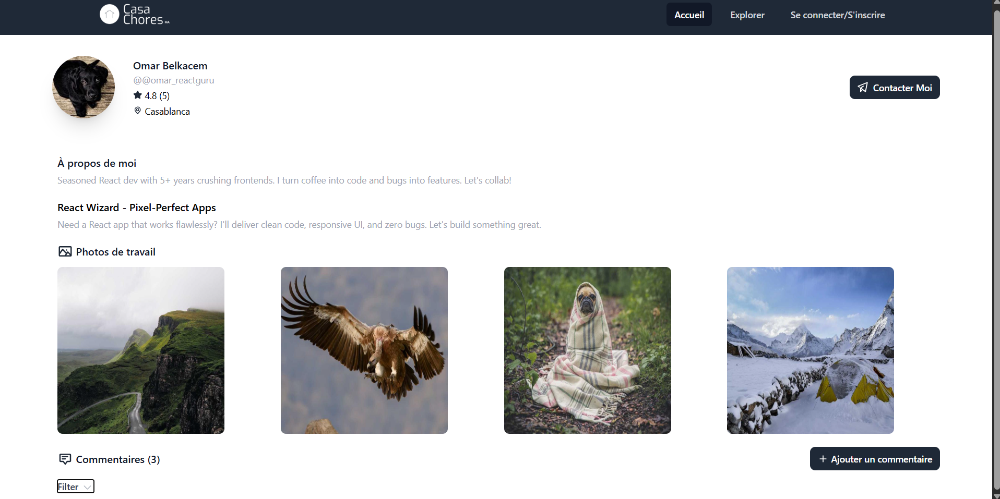
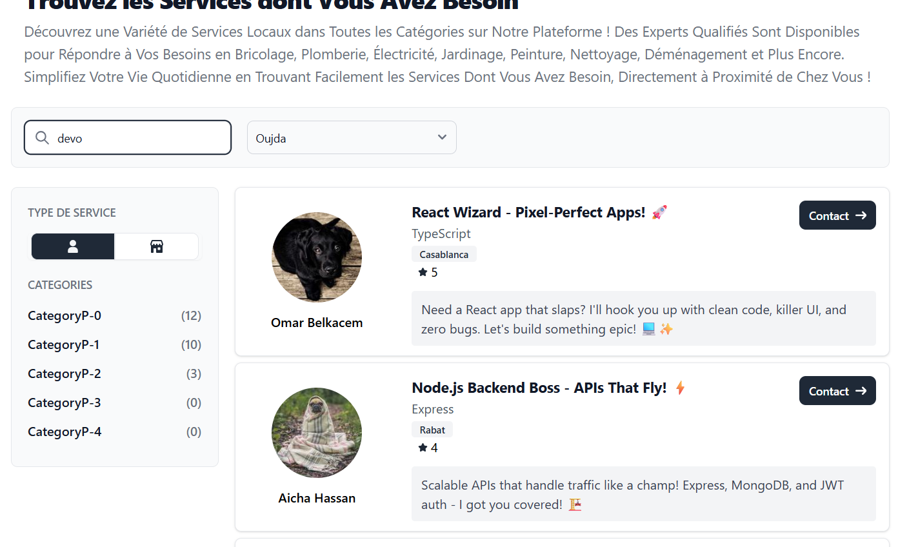

```markdown
# CasaChores

 *Smart search with auto-location*

## Overview

Connects clients to experts seamlessly. Need code? Hire a dev. Leaky pipe? Get a local fix.

## Features

- Auto city detection & filters
- Advanced search by cat/location/rating
- Socket.io chat
- Profiles with portfolios/reviews
- JWT auth + Twilio WhatsApp verify
- File uploads
- Ratings/reviews
- Responsive UI

## Tech

**Front:** React TS, Tailwind, shadcn/ui, Vite

**Back:** Node Express, Socket.io, Twilio, Multer, Nodemon

**DB:** MongoDB Mongoose, JWT

## Setup

**Prereqs:** Node 18+, Mongo, Git, Twilio acct

**Backend:**
```bash
cd server
npm i
# .env: MONGO_URI, JWT_SECRET, TWILIO_SID/AUTH_TOKEN/PHONE, PORT=5000, KEY=session_secret
nodemon app.js
```

**Frontend:**
```bash
cd client
npm i
npm run dev
```

**DB Seed:**
```bash
node server/seeddb.js
```

## API Endpoints

From app.js - prefixes only, check routers for subs:

- `/check` - Username check
- `/get` - Categories/cities/posts
- `/remove` - Remove img
- `/register` - Signup w/ WhatsApp verify
- `/new` - Seller/post/comment
- `/vote` - Comment vote
- `/login` - Login
- `/logout` - Logout
- `/jwt` - Auth check
- `/ws` - WhatsApp check
- `/usersettings` - User settings
- `/edit/user` - Edit user
- `/upload` - Img upload
- `/chat` - Chat ops
- `/test` - Test users

## Structure

**Client:** components/pages for UI/chat/search/posts/profiles

**Server:** routers/schemas/middleware/db/bot/uploads

## Env Vars

**Server .env:**
```
MONGO_URI=...
JWT_SECRET=...
TWILIO_SID=...
TWILIO_AUTH_TOKEN=...
TWILIO_PHONE=...
PORT=5000
KEY=...
UPLOAD_PATH=./uploads
```

**Client .env:**
```
VITE_API_URL=http://localhost:5000
VITE_SOCKET_URL=http://localhost:5000
```

## Deploy

DB: Atlas
Back: Render/Heroku
Front: Vercel/Netlify
Files: S3/Cloudinary
Twilio: Prod sandbox

## Screenshots





## Workflow

Run back: `cd server && nodemon app.js`
Run front: `cd client && npm run dev`
Test APIs: Postman
Seed: `node server/seeddb.js`

## Contributing

Fork, branch, PR clean code.

**Standards:** TS, ESLint, tests, <300 lines/comp

## Security

JWT cookies, bcrypt pw, sanitized uploads, rate limits, CORS, Twilio anti-fake
